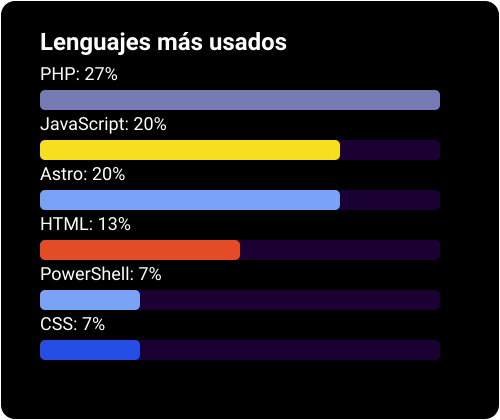

# 💫 Acerca de mí:

Desarrollador web full-stack, me encantan los proyectos con propósito. Tengo experiencia en diversas tecnologías y frameworks.

# 💻 Stack Tecnológico:

                    

# 📊 GitHub Stats:

 

# Generado por  :

